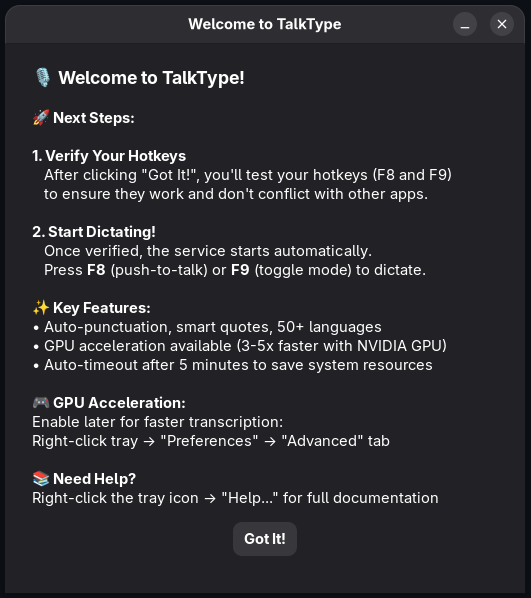
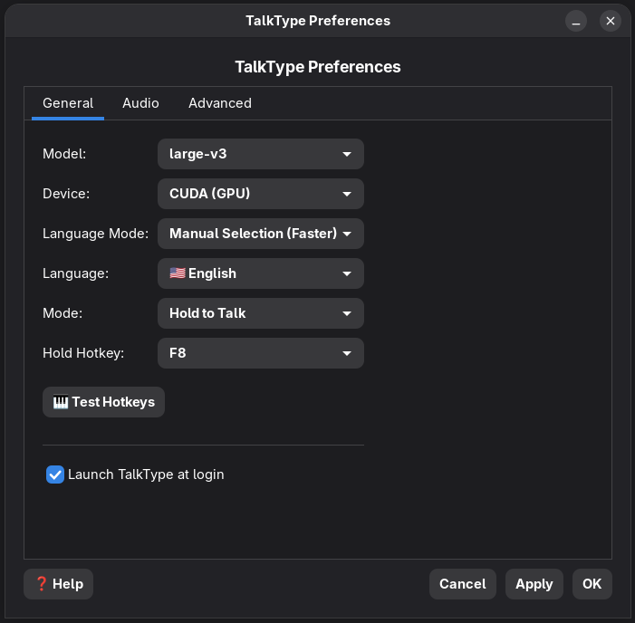

# TalkType

Press-and-hold (or toggle) voice dictation for Linux Wayland, using Faster-Whisper for speech recognition and ydotool for text injection.

## 📸 Screenshots

<p align="center">
  
  
</p>

<p align="center">
  <em>Welcome screen with first-run guidance • Preferences with GPU acceleration settings</em>
</p>

## ✨ Features

- **🎙️ Voice Dictation**: Press and hold F8 to dictate, release to transcribe and type
- **🎯 Smart Text Processing**: Automatic punctuation, capitalization, and formatting
- **📱 System Tray**: Easy start/stop control with visual status indicator
- **⚙️ GUI Preferences**: Configure hotkeys, audio settings, and behavior
- **🔧 Voice Commands**: "comma", "period", "new line", "new paragraph", "open quote", etc.
- **🚀 GPU Acceleration**: Optional CUDA support for faster transcription
- **🌐 Wayland Native**: Works seamlessly on modern Linux desktops

## 📦 Installation

### Arch Linux (AUR)
```bash
yay -S talktype-appimage
# or
paru -S talktype-appimage
```

### AppImage (All Distros)
Download the latest AppImage from [Releases](https://github.com/ronb1964/TalkType/releases):
```bash
chmod +x TalkType-v*.AppImage
./TalkType-v*.AppImage
```

The AppImage includes everything needed - just run it!

### From Source (Development)

#### Prerequisites
```bash
# Install system dependencies (Fedora/Nobara)
sudo dnf install -y portaudio-devel ffmpeg ydotool wl-clipboard \
                    python3-gobject libappindicator-gtk3 libnotify

# Enable AppIndicator for GNOME (if using GNOME)
sudo dnf install -y gnome-shell-extension-appindicator
gnome-extensions enable appindicatorsupport@rgcjonas.gmail.com
```

#### Setup ydotool daemon
```bash
# Create systemd service for ydotool
mkdir -p ~/.config/systemd/user
cat > ~/.config/systemd/user/ydotoold.service <<'EOF'
[Unit]
Description=ydotool daemon (Wayland keystroke injector)
After=graphical-session.target

[Service]
Environment=XDG_RUNTIME_DIR=%t
ExecStart=/usr/bin/ydotoold --socket-path=%t/.ydotool_socket
Restart=on-failure

[Install]
WantedBy=default.target
EOF

systemctl --user daemon-reload
systemctl --user enable --now ydotoold.service
```

#### Install TalkType
```bash
# Clone and setup
git clone https://github.com/ronb1964/TalkType.git
cd TalkType
poetry install

# Run tests
poetry run pytest -q

# Start the tray (which manages the dictation service)
poetry run dictate-tray &
```

## 🎯 Usage

1. **Start dictation**: Right-click tray icon → "Start Service"
2. **Dictate**: Press and hold F8, speak, then release
3. **Voice commands**: Say "comma", "period", "new line", "new paragraph", etc.
4. **Configure**: Right-click tray → "Preferences..." for settings
5. **Stop**: Right-click tray → "Stop Service"

## 🔧 Voice Commands

| Say This | Gets Typed |
|----------|------------|
| "comma" | , |
| "period" | . |
| "question mark" | ? |
| "exclamation point" | ! |
| "new line" | Shift+Enter (soft break) |
| "new paragraph" | Two Shift+Enter (paragraph break) |
| "open quote" / "close quote" | Smart quotes " " |
| "dot dot dot" | … (ellipsis) |

## ⚙️ Configuration

Settings are stored in `~/.config/talktype/config.toml`:

```toml
model = "small"           # Whisper model size
device = "cpu"            # "cpu" or "cuda"
hotkey = "F8"            # Dictation key
mode = "hold"            # "hold" or "toggle"
beeps = true             # Audio feedback
smart_quotes = true      # Use curly quotes
auto_space = true        # Auto-space between utterances
notify = true            # Desktop notifications
```

## 🛠️ Development

```bash
# Run dictation service directly
poetry run dictate

# Run tray application
poetry run dictate-tray

# Open preferences GUI
poetry run dictate-prefs

# Run tests
poetry run pytest -q
```

**⚠️ IMPORTANT: Before testing AppImage builds, ALWAYS follow [TESTING_PROCEDURES.md](TESTING_PROCEDURES.md)**

## 📋 Requirements

- **OS**: Linux with Wayland
- **Python**: 3.10+
- **Audio**: Working microphone
- **Dependencies**: ydotool, portaudio, ffmpeg

## 🐛 Troubleshooting

**Text not appearing?**
- Ensure ydotoold service is running: `systemctl --user status ydotoold`
- Check socket exists: `ls -l $XDG_RUNTIME_DIR/.ydotool_socket`

**Tray icon not visible?**
- Install AppIndicator extension for GNOME
- Log out and back in after installation

**Double characters or no response?**
- Stop any old dictation services
- Restart through tray menu: "Restart Service"

## 📄 License

MIT License - see LICENSE file for details.
