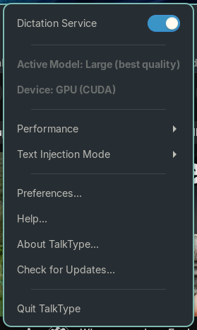
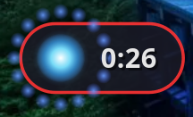
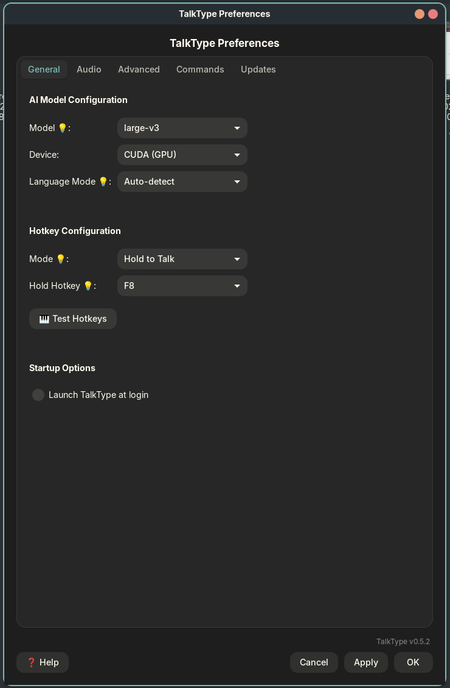
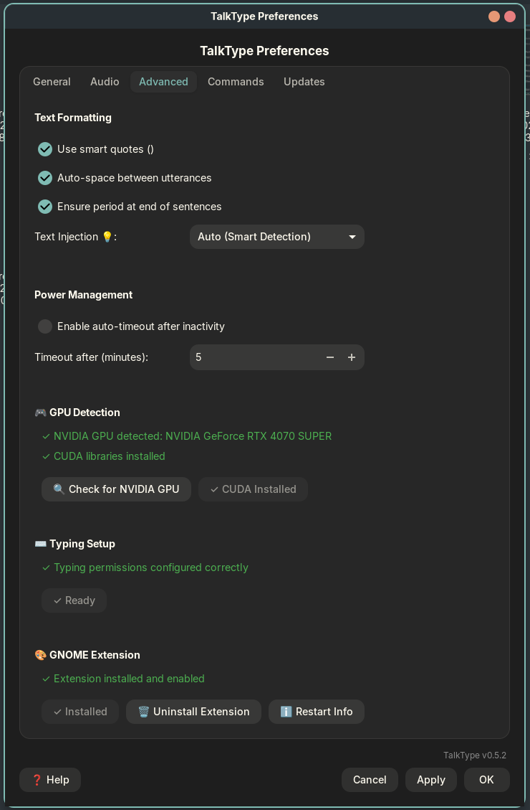
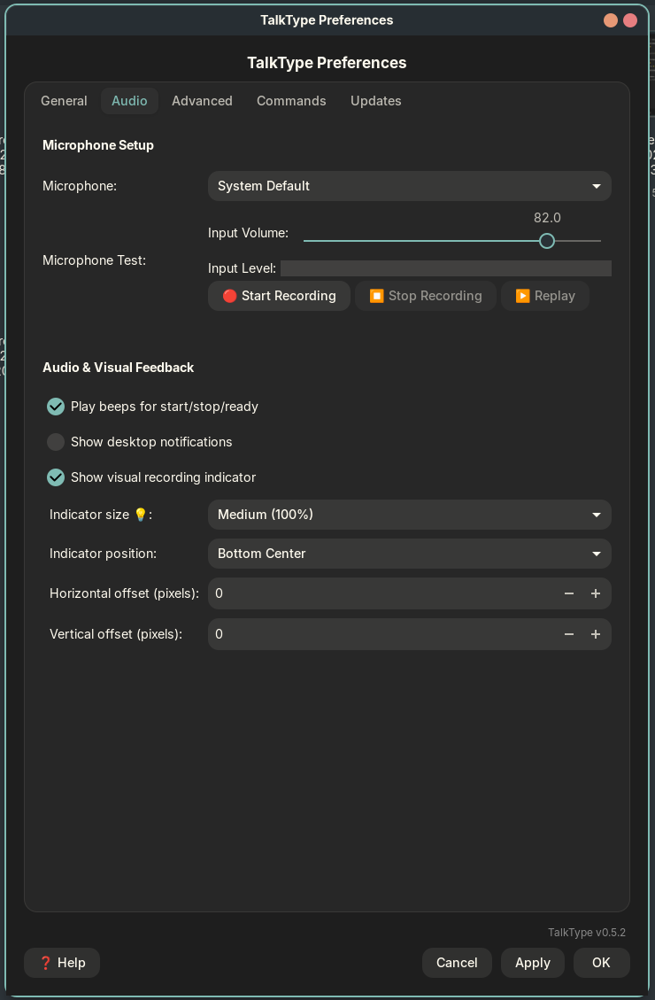
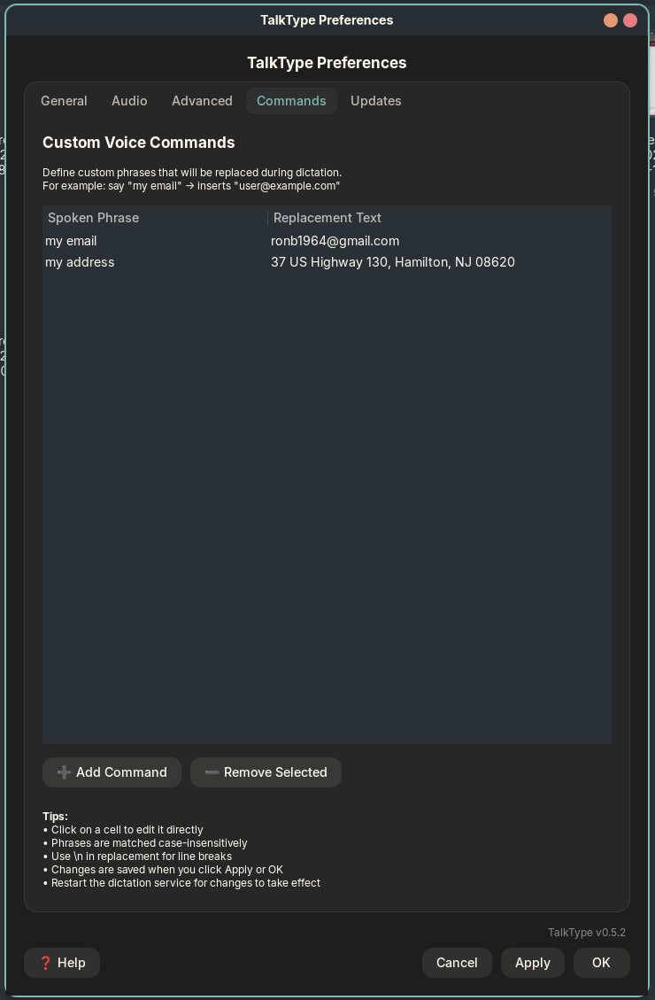
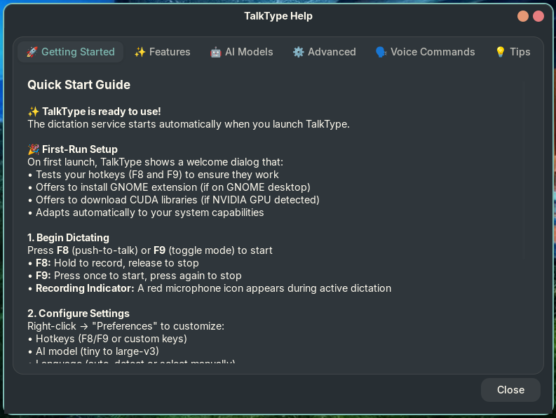
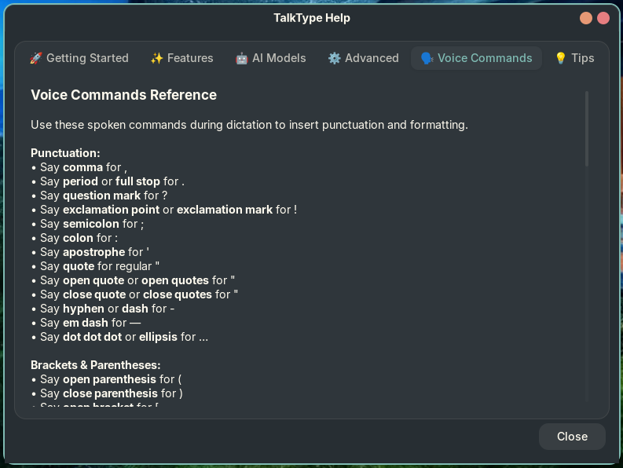

# TalkType

**Voice dictation for Linux Wayland** - Press F8 to talk, release to type. Powered by OpenAI's Whisper AI for accurate speech recognition.

[](https://aur.archlinux.org/packages/talktype-appimage)
[](https://github.com/ronb1964/TalkType/releases)
[](LICENSE)

---

## Screenshots

<p align="center">
  
  &nbsp;&nbsp;&nbsp;
  
</p>
<p align="center">
  <em>System tray menu &bull; Recording indicator with timer</em>
</p>

<p align="center">
  
  
</p>
<p align="center">
  <em>General settings with model selection &bull; Advanced settings with GPU acceleration</em>
</p>

<p align="center">
  
  
</p>
<p align="center">
  <em>Audio settings with microphone test &bull; Custom voice commands</em>
</p>

<p align="center">
  
  
</p>
<p align="center">
  <em>Built-in help with getting started guide &bull; Complete voice commands reference</em>
</p>

---

## Features

- **Push-to-Talk or Toggle Mode** - F8 (hold) or F9 (toggle) - fully customizable hotkeys
- **AI-Powered Transcription** - Uses OpenAI's Whisper models (tiny to large-v3)
- **GPU Acceleration** - Optional NVIDIA CUDA support for 3-5x faster transcription
- **Smart Text Processing** - Auto-punctuation, smart quotes, auto-spacing
- **Voice Commands** - Say "comma", "period", "new paragraph", "undo last word", and more
- **Custom Commands** - Define your own phrase shortcuts (e.g., "my email" → your@email.com)
- **Visual Feedback** - On-screen recording indicator with timer
- **GNOME Integration** - Native shell extension for GNOME desktop
- **Auto-Updates** - Built-in update checker with one-click downloads
- **Wayland Native** - Works seamlessly on modern Linux desktops

---

## Installation

### Arch Linux (AUR)

```bash
yay -S talktype-appimage
# or
paru -S talktype-appimage
```

### AppImage (All Distros)

Download the latest AppImage from [Releases](https://github.com/ronb1964/TalkType/releases):

```bash
chmod +x TalkType-v*.AppImage
./TalkType-v*.AppImage
```

The AppImage includes everything needed - just download and run!

> **Note:** AppImages require FUSE 2 (`libfuse.so.2`). Install if needed:
> - **Fedora/RHEL**: `sudo dnf install fuse`
> - **Ubuntu/Debian**: `sudo apt install libfuse2`
> - **Arch/Manjaro**: `sudo pacman -S fuse2`
> - **openSUSE**: `sudo zypper install libfuse2`

### System Requirements

| Requirement | Details |
|------------|---------|
| **OS** | Linux with Wayland |
| **Dependencies** | ydotool, wl-clipboard (installed automatically on first run) |
| **Audio** | Working microphone |
| **GPU (optional)** | NVIDIA GPU for CUDA acceleration |

---

## Quick Start

1. **Launch TalkType** - Run the AppImage or use your app launcher
2. **First-run setup** - TalkType will guide you through initial configuration
3. **Start dictating** - Press **F8** (hold to record) or **F9** (toggle mode)
4. **Speak naturally** - Text appears where your cursor is
5. **Use voice commands** - Say "comma", "period", "new line", etc.

### Hotkey Modes

| Mode | Hotkey | How it works |
|------|--------|--------------|
| **Push-to-Talk** | F8 | Hold to record, release to transcribe |
| **Toggle** | F9 | Press to start, press again to stop |

---

## Voice Commands

### Punctuation
| Say This | Result |
|----------|--------|
| "comma" | , |
| "period" / "full stop" | . |
| "question mark" | ? |
| "exclamation point" | ! |
| "colon" | : |
| "semicolon" | ; |
| "open quote" / "close quote" | " " (smart quotes) |
| "dot dot dot" / "ellipsis" | ... |

### Formatting
| Say This | Result |
|----------|--------|
| "new line" | Line break |
| "new paragraph" | Double line break |
| "tab" | Tab character |

### Editing
| Say This | Result |
|----------|--------|
| "undo last word" | Deletes last word |
| "undo last sentence" | Deletes to previous sentence |
| "undo everything" | Clears all dictated text |

### Literal Words
Say **"literal"** before any command to output the word instead:
- "literal comma" → types "comma" (not ,)
- "literal period" → types "period" (not .)

---

## AI Models

Choose the right model for your needs in Preferences → General:

| Model | Size | Speed | Accuracy | Best For |
|-------|------|-------|----------|----------|
| **tiny** | 39 MB | Fastest | Basic | Quick notes |
| **base** | 74 MB | Fast | Good | Casual use |
| **small** | 244 MB | Balanced | Very Good | **Recommended** |
| **medium** | 769 MB | Slower | Excellent | Professional |
| **large-v3** | ~3 GB | Slowest | Best | Technical work |

> **Tip:** Start with "small" for everyday use. Enable GPU acceleration for larger models.

---

## GPU Acceleration

TalkType supports NVIDIA CUDA for 3-5x faster transcription:

1. **Automatic detection** - TalkType detects your NVIDIA GPU on first run
2. **One-click download** - Download CUDA libraries (~800MB) when prompted
3. **Automatic activation** - GPU mode enables after download

You can also enable GPU later: **Preferences → Advanced → Download CUDA Libraries**

---

## Configuration

Settings are stored in `~/.config/talktype/config.toml`:

```toml
model = "small"           # AI model: tiny, base, small, medium, large-v3
device = "cpu"            # "cpu" or "cuda" (GPU)
hold_hotkey = "F8"        # Push-to-talk key
toggle_hotkey = "F9"      # Toggle recording key
mode = "hold"             # Default mode: "hold" or "toggle"
language_mode = "auto"    # "auto" or specific language code
beeps = true              # Audio feedback sounds
smart_quotes = true       # Use curly quotes " "
auto_space = true         # Auto-space between utterances
auto_period = true        # Add period at end of sentences
```

---

## Development

### From Source

```bash
# Prerequisites (Fedora/Nobara)
sudo dnf install -y portaudio-devel ffmpeg ydotool wl-clipboard \
                    python3-gobject libappindicator-gtk3 libnotify

# Clone and install
git clone https://github.com/ronb1964/TalkType.git
cd TalkType
poetry install

# Run
poetry run dictate-tray
```

### ydotool Setup

TalkType requires ydotool for text injection:

```bash
# Create systemd service
mkdir -p ~/.config/systemd/user
cat > ~/.config/systemd/user/ydotoold.service <<'EOF'
[Unit]
Description=ydotool daemon
After=graphical-session.target

[Service]
Environment=XDG_RUNTIME_DIR=%t
ExecStart=/usr/bin/ydotoold --socket-path=%t/.ydotool_socket
Restart=on-failure

[Install]
WantedBy=default.target
EOF

# Enable and start
systemctl --user daemon-reload
systemctl --user enable --now ydotoold.service
```

---

## Troubleshooting

### Text not appearing?
- Check ydotoold is running: `systemctl --user status ydotoold`
- Verify socket exists: `ls $XDG_RUNTIME_DIR/.ydotool_socket`

### Hotkey not working?
- Another app may be using F8/F9 - try different keys in Preferences
- Ensure TalkType service is running (check tray icon)

### Transcription slow?
- Enable GPU acceleration if you have NVIDIA GPU
- Try a smaller model (tiny or base)
- Use Performance presets in tray menu

### Tray icon not visible (GNOME)?
- TalkType offers to install its GNOME extension on first run
- Or manually: Preferences → Advanced → Install Extension

---

## License

MIT License - see [LICENSE](LICENSE) file for details.

---

<p align="center">
  <b>TalkType</b> - Voice dictation that just works.<br>
  <a href="https://github.com/ronb1964/TalkType/releases">Download</a> &bull;
  <a href="https://github.com/ronb1964/TalkType/issues">Report Bug</a> &bull;
  <a href="https://github.com/ronb1964/TalkType/issues">Request Feature</a>
</p>
