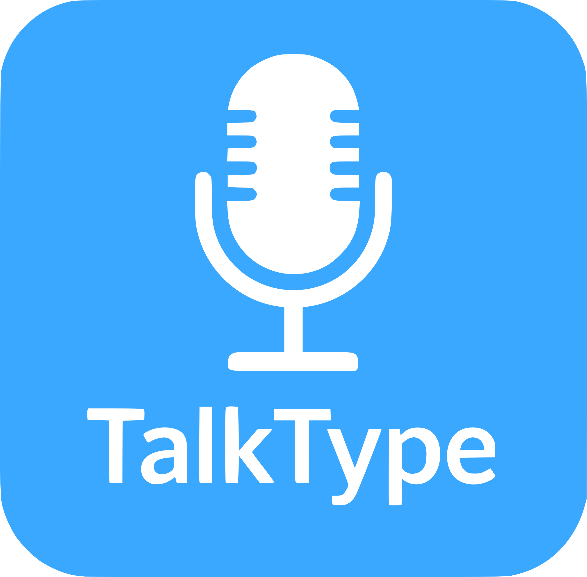
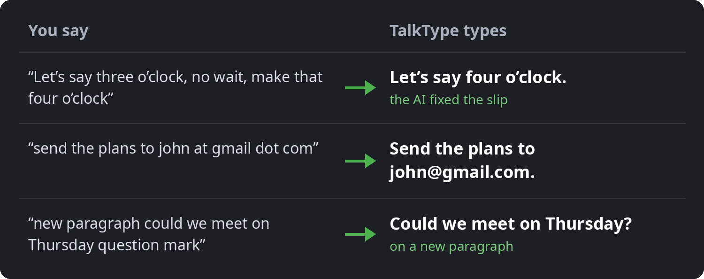
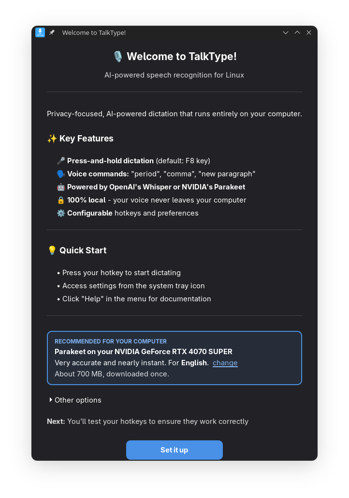
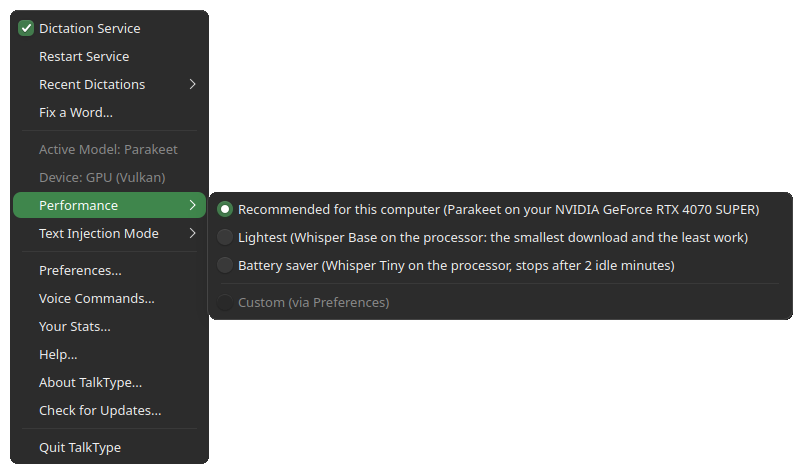
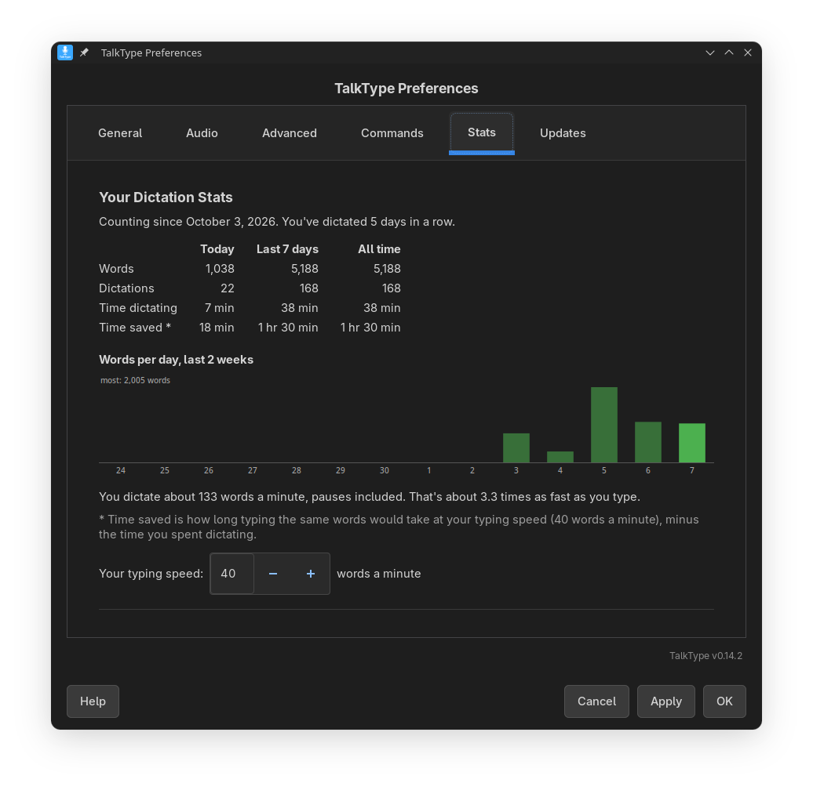
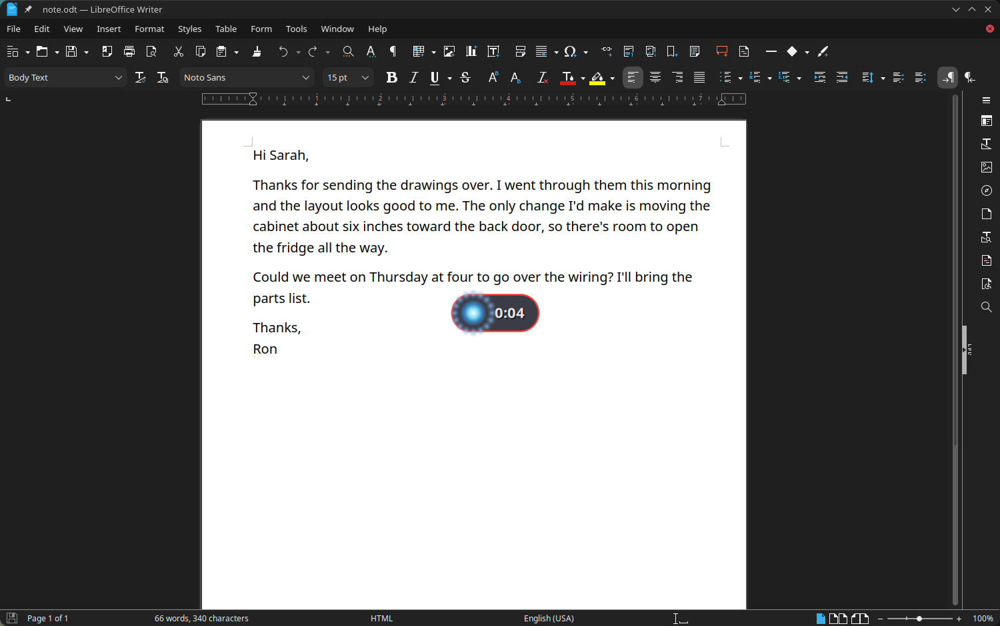
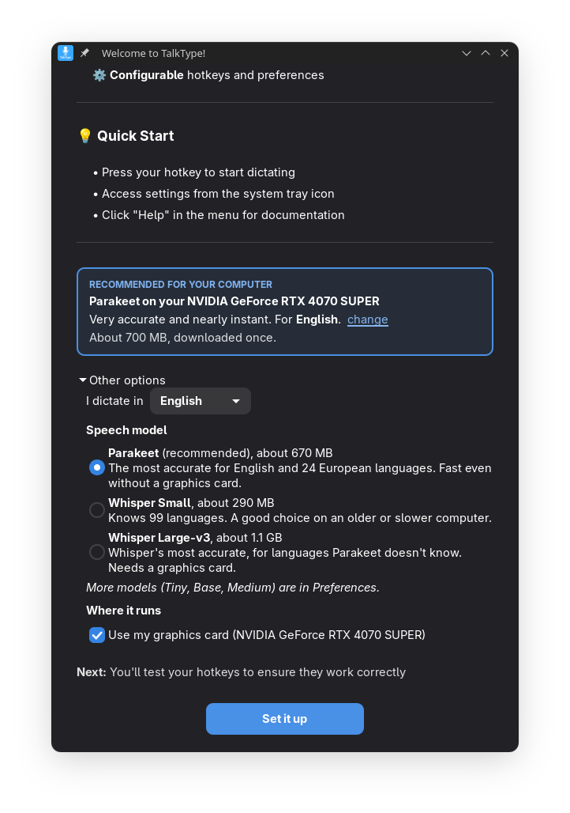
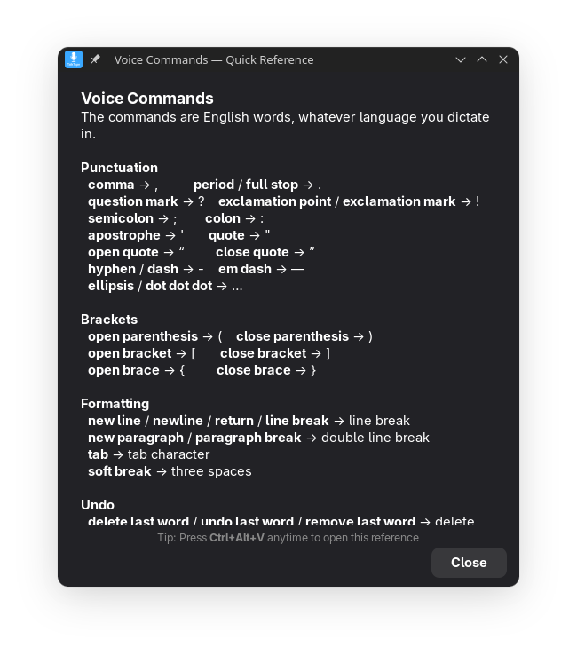

<p align="center">
  
</p>

<h1 align="center">TalkType</h1>

<p align="center">
  <b>Hold a key, talk, let go. Your words show up wherever your cursor is.</b><br>
  Free voice dictation for Linux. It runs offline, and it works on Wayland.
</p>

<p align="center">
  <a href="https://github.com/ronb1964/TalkType/releases/latest"></a>
  <a href="https://aur.archlinux.org/packages/talktype-appimage"></a>
  <a href="LICENSE"></a>
  
</p>

<p align="center">
  <a href="#installation">Install</a> &nbsp;&bull;&nbsp;
  <a href="#what-it-does">What it does</a> &nbsp;&bull;&nbsp;
  <a href="#all-the-features">All the features</a> &nbsp;&bull;&nbsp;
  <a href="CHANGELOG.md">What's new</a>
</p>

<p align="center">
  
</p>

That works on GNOME, KDE, Sway, Hyprland and X11 with no setup, because TalkType reads the key straight from the keyboard instead of asking the desktop for it. Most Linux dictation tools can't do hold-to-talk on Wayland at all.

It's free, it runs completely offline, and nothing you say ever leaves your computer.

---

## What it does

<p align="center">
  
</p>

**It fixes it when you change your mind.** Say "no wait", "scratch that" or "actually" and correct yourself, and a small AI model on your own computer drops the wrong part. Every fix gets checked, and if the AI changed anything else, your words are typed exactly as you said them. It's optional, and it's off until you turn it on.

**Commands and addresses come out right.** Say "comma", "new paragraph" or "question mark" and you get the punctuation. Say an email or a web address the way you'd say it out loud and it's written the way it should be.

<table>
<tr>
<td width="50%"></td>
<td>

### Set up for your computer

First run looks at your graphics card and your language and picks a setup for you. On a graphics card, a sentence is typed out in about a fifth of a second. No graphics card is fine too: the default model is fast on an ordinary processor.

Want something else? One button shows every choice, with what it costs you in download size and speed.

</td>
</tr>
<tr>
<td>

### Teach it your words

Names, brands, the part numbers you use every day. If TalkType keeps getting one wrong, pick it out of a recent dictation with **Fix a Word**, type it the right way, and it's fixed from then on.

You can also make your own shortcuts, like "my email" for your address.

</td>
<td width="50%"></td>
</tr>
<tr>
<td width="50%"></td>
<td>

### Everything from the tray

Start and stop dictation, switch between Recommended, Lightest and Battery saver, or grab one of your last 20 dictations back if the text landed in the wrong window. Those are kept in memory only and gone when you log out.

</td>
</tr>
<tr>
<td>

### See how much typing it saves you

Your Stats shows the words you've dictated today, this week and all time, and how long it would've taken to type them. Only the numbers are kept, never what you said.

</td>
<td width="50%"></td>
</tr>
</table>

---

## Installation

### Arch Linux (AUR)

```bash
yay -S talktype-appimage
# or
paru -S talktype-appimage
```

Installed it and it works? A
[vote on the AUR page](https://aur.archlinux.org/packages/talktype-appimage)
helps other Arch users find it — one click if you're logged in.

### Debian / Ubuntu / Linux Mint (.deb)

Download `talktype_*_amd64.deb` from [Releases](https://github.com/ronb1964/TalkType/releases):

```bash
sudo apt install ./talktype_*_amd64.deb
```

### Fedora / RHEL / openSUSE (.rpm)

Download `talktype-*.x86_64.rpm` from [Releases](https://github.com/ronb1964/TalkType/releases):

```bash
sudo dnf install ./talktype-*.x86_64.rpm
```

Both packages install to `/opt/talktype`, add a `talktype` command and an
Applications menu entry, and pull in the few system libraries they need.

### AppImage (All Distros)

Download the latest AppImage from [Releases](https://github.com/ronb1964/TalkType/releases):

```bash
chmod +x TalkType-v*.AppImage
./TalkType-v*.AppImage
```

The AppImage includes everything needed - just download and run!

> **Note:** AppImages require FUSE 2 (`libfuse.so.2`). Install if needed:
> - **Fedora/RHEL**: `sudo dnf install fuse`
> - **Ubuntu/Debian**: `sudo apt install libfuse2`
> - **Arch/Manjaro**: `sudo pacman -S fuse2`
> - **openSUSE**: `sudo zypper install libfuse2`

### Flatpak

A sandboxed Flatpak build of TalkType already works, but it isn't published for
download yet. **Want a Flatpak version?**
👉 **[Vote in the poll](https://github.com/ronb1964/TalkType/discussions/6)** —
enough interest and I'll make it happen.

### System Requirements

| Requirement | Details |
|------------|---------|
| **OS** | Linux with Wayland |
| **Dependencies** | None to install by hand — ydotool, ydotoold and wl-clipboard ship inside TalkType, and the ydotoold daemon starts automatically on first run |
| **Permissions** | First run asks for your admin password once, to let TalkType read your keyboard and type into other apps. **Restart afterwards** for it to take effect |
| **Audio** | Working microphone |
| **GPU (optional)** | Any NVIDIA, AMD or Intel graphics chip (Vulkan), or CUDA on NVIDIA |

---

## Quick Start

1. **Launch TalkType** - Run the AppImage or use your app launcher
2. **First-run setup** - TalkType will guide you through initial configuration
3. **Start dictating** - Press **F8** (hold to record) or **F9** (tap to toggle) — both always active
4. **Speak naturally** - Text appears where your cursor is
5. **Use voice commands** - Say "comma", "period", "new line", etc.

### Hotkeys (Both Always Active)

| Hotkey | How it works |
|--------|--------------|
| **F8** | Hold to record, release to transcribe (hold-to-talk) |
| **F9** | Press once to start, press again to stop (tap-to-toggle) |

---

## All the features

- **Two hotkeys, both always on.** Hold F8 to talk, or tap F9 to start and tap again to stop. Pick any keys you like.
- **Hands-free if you want it.** Double-tap F9, talk, and it stops by itself when you go quiet. A single tap still works as a plain on/off switch, so a long dictation with thinking pauses never gets cut off.
- **Your choice of speech model.** NVIDIA's Parakeet is the default: fast on any processor, for English and 24 European languages. OpenAI's Whisper covers 99 languages, from Tiny up to Large-v3.
- **Any graphics card.** NVIDIA, AMD or Intel through Vulkan, a 24 MB download. On NVIDIA you can use CUDA instead. TalkType times your graphics chip against your processor first and only uses it if it's really faster.
- **Corrections.** Say "no wait", "scratch that", "I mean" or "actually" and the optional AI fixes it. It also drops "um", "uh" and stutters.
- **Voice commands.** "comma", "period", "new paragraph", "undo last word", "delete last three sentences" and more. See the full list below.
- **Email and web addresses.** "john at gmail dot com" types john@gmail.com, and "github dot com" types github.com.
- **Your own commands.** Make a phrase type anything you want, like "my email" for your address.
- **Fix a Word.** Teach it a name or term it keeps getting wrong.
- **Recent Dictations.** Your last 20, one click to copy. Kept in memory only.
- **Your Stats.** Words dictated and typing time saved, at your own typing speed.
- **A recording indicator you can style.** Orb, waveform, frequency bars or radial, any color, anywhere on screen. It reacts to your voice so you know it's listening.
- **Tells you why when it can't type.** If a dictation can't be typed into the window, TalkType says why and what fixes it.
- **Private.** Everything runs on your computer, and what you dictate is never written to a log unless you turn that on for troubleshooting.
- **GNOME extension.** A native panel menu on GNOME, and a tray icon everywhere else.
- **Updates the right way.** Through your package manager for the .deb and .rpm, in place for the AppImage, or through your AUR helper on Arch.

---

## More

<details>
<summary><b>More screenshots</b></summary>

<p align="center">
  
</p>
<p align="center"><em>Hold F8 and talk: the indicator shows TalkType is listening, and your words land wherever you're typing</em></p>

<p align="center">
  
  
</p>
<p align="center"><em>First run recommends a setup &bull; one button shows every choice</em></p>

<p align="center">
  
  
</p>
<p align="center"><em>Model, graphics card and hotkeys &bull; Dictation cleanup and AI self-corrections</em></p>

<p align="center">
  
  
</p>
<p align="center"><em>Microphone test and recording indicator &bull; The Voice Commands quick reference</em></p>

<p align="center">
  
  
</p>
<p align="center"><em>Built-in help</em></p>

</details>

<details>
<summary><b>Voice commands, the full list</b></summary>

### Punctuation
| Say This | Result |
|----------|--------|
| "comma" | , |
| "period" / "full stop" | . |
| "question mark" | ? |
| "exclamation point" | ! |
| "colon" | : |
| "semicolon" | ; |
| "open quote" / "close quote" | " " (smart quotes) |
| "dot dot dot" / "ellipsis" | ... |

### Formatting
| Say This | Result |
|----------|--------|
| "new line" | Line break |
| "new paragraph" | Double line break |
| "tab" | Tab character |

### Editing
| Say This | Result |
|----------|--------|
| "undo last word" | Deletes the last word |
| "undo last sentence" | Deletes to the previous sentence |
| "undo last paragraph" | Deletes the last paragraph |
| "delete last three words" | Deletes several at once — words, sentences or paragraphs |
| "delete last 5 sentences" | Digits work too; counts above what you dictated are clamped |
| "clear everything" | Clears the **entire** input field (see warning below) |

**Undo, delete and remove are interchangeable** — say whichever comes naturally
("delete last word", "remove last two sentences"). Counts accept digits or the
words one through ten.

> ⚠️ **"clear everything" empties the whole field, not just what you dictated.**
> The phrases *undo/delete/clear* + *everything/all* — six in total — all do the
> same thing: select all and delete. That includes text you typed yourself, so
> it is not limited to the current dictation.

### Literal Words
Say **"literal"** before any command to output the word instead:
- "literal comma" → types "comma" (not ,)
- "literal period" → types "period" (not .)

</details>

<details>
<summary><b>Speech models</b></summary>

Choose the right model for your needs in Preferences → General:

| Model | Size | Speed | Accuracy | Best For |
|-------|------|-------|----------|----------|
| **tiny** | 78 MB | Fastest | Basic | Quick notes |
| **base** | 148 MB | Fast | Good | Casual use |
| **small** | 486 MB | Balanced | Very Good | Any of 99 languages |
| **medium** | 1.5 GB | Slower | Excellent | Professional |
| **large-v3** | 3.1 GB | Slowest | Best | Technical work |
| **Parakeet** | 670 MB | Fast, even without a GPU | Best | **Recommended** for English + 24 European languages |

> **Tip:** First run recommends a setup for your computer and language, and tray → Performance → **Recommended for this computer** puts you back on it any time.
> **Parakeet** is the default. It's a different engine that NVIDIA made, and it runs on your processor (or on your graphics card through Vulkan). It doesn't cover Chinese, Japanese, Korean, Arabic and other non-European languages. For those, first run picks Whisper: Small on the processor, or Large-v3 on a graphics card.

</details>

<details>
<summary><b>Graphics cards</b></summary>

A graphics card makes the Whisper models much faster, and with Vulkan it speeds up Parakeet too. There are two ways to use one:

| | Works on | Download | Pick it in |
|---|---|---|---|
| **Vulkan (Light)** | NVIDIA, AMD and Intel | 24 MB | Preferences → General → Device → Vulkan (any GPU) |
| **CUDA (Full)** | NVIDIA only | 1.4 GB | Preferences → Advanced → Download CUDA Libraries |

On an RTX 4070 Super both were equally fast: half a second for 11 seconds of speech with the Large model. First run uses any graphics card through Vulkan. CUDA is set up from Preferences.

Before switching to Vulkan, TalkType times your graphics chip against your processor and only switches if the graphics chip is clearly faster. The graphics built into some desktop processors is too small to help, and in that case it tells you and keeps using the processor.

Parakeet doesn't need a graphics card, since it's already fast on the processor. With the device set to Vulkan it runs on the graphics card anyway: on an RTX 4070 Super, a minute of speech took 0.2 seconds instead of 2, with the same accuracy. That needs a second copy of Parakeet in the graphics engine's format (669 MB). The processor copy stays too, as a fallback. CUDA can't run Parakeet.

</details>

<details>
<summary><b>Settings file</b></summary>

Settings are stored in `~/.config/talktype/config.toml`:

```toml
model = "parakeet-v3"     # AI model: parakeet-v3, tiny, base, small, medium, large-v3
device = "cpu"            # "cpu", "vulkan" (any GPU) or "cuda" (NVIDIA)
hotkey = "F8"             # Hold-to-talk key (hold to record, release to stop)
toggle_hotkey = "F9"      # Tap-to-toggle key (press once start, press again stop)
# Both hotkeys are always active simultaneously
language_mode = "auto"    # "auto", or "manual" to use the language below
language = ""             # language code for manual mode, e.g. "de"
beeps = true              # Audio feedback sounds
smart_quotes = true       # Use curly quotes " "
auto_space = true         # Auto-space between utterances
auto_period = true        # Add period at end of sentences
```

</details>

<details>
<summary><b>Troubleshooting</b></summary>

### Text not appearing?
- Check ydotoold is running: `systemctl --user status ydotoold`
- Verify socket exists: `ls $XDG_RUNTIME_DIR/.ydotool_socket`

### Hotkey not working?
- Another app may be using F8/F9 - try different keys in Preferences
- Ensure TalkType service is running (check tray icon)

### No hotkey works at all?
TalkType reads your keyboard directly, which requires your account to be in the
system's `input` group. Without it no key can be detected, even though the app
looks like it started fine.

- Preferences → Advanced → Typing Setup → **Fix Typing Permissions**
- **Then restart your computer.** Logging out and back in is often not enough —
  a lingering user session keeps the old group list alive
- Check it worked with `groups`; the list should include `input`

Most common on Fedora, where permission to *type* is granted separately from
permission to *read keys*, so typing can work while hotkeys do not.

### Transcription slow?
- Use your graphics card if you have one (see [GPU Acceleration](#gpu-acceleration))
- Try Parakeet, or a smaller Whisper model (tiny or base)
- Tray menu → Performance → Recommended for this computer

### Tray icon not visible (GNOME)?
- TalkType offers to install its GNOME extension on first run
- Or manually: Preferences → Advanced → Install Extension

</details>

<details>
<summary><b>Building from source</b></summary>

### From Source

```bash
# Prerequisites (Fedora/Nobara)
sudo dnf install -y portaudio-devel ffmpeg ydotool wl-clipboard \
                    python3-gobject libayatana-appindicator-gtk3 libnotify

# Clone and install
git clone https://github.com/ronb1964/TalkType.git
cd TalkType
poetry install

# Run
poetry run dictate-tray
```

### ydotool Setup

TalkType requires ydotool for text injection:

```bash
# Create systemd service
mkdir -p ~/.config/systemd/user
cat > ~/.config/systemd/user/ydotoold.service <<'EOF'
[Unit]
Description=ydotool daemon
After=graphical-session.target

[Service]
Environment=XDG_RUNTIME_DIR=%t
ExecStart=/usr/bin/ydotoold --socket-path=%t/.ydotool_socket
Restart=on-failure

[Install]
WantedBy=default.target
EOF

# Enable and start
systemctl --user daemon-reload
systemctl --user enable --now ydotoold.service
```

</details>

---

## License

MIT License. See [LICENSE](LICENSE) for details.

<p align="center">
  <a href="https://github.com/ronb1964/TalkType/releases/latest">Download</a> &bull;
  <a href="CHANGELOG.md">Changelog</a> &bull;
  <a href="https://github.com/ronb1964/TalkType/issues">Report a bug</a> &bull;
  <a href="https://github.com/ronb1964/TalkType/discussions">Ideas and questions</a>
</p>
