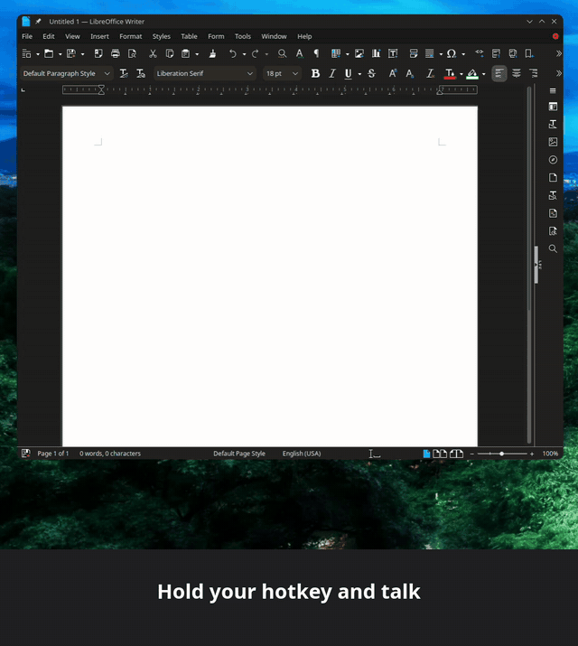
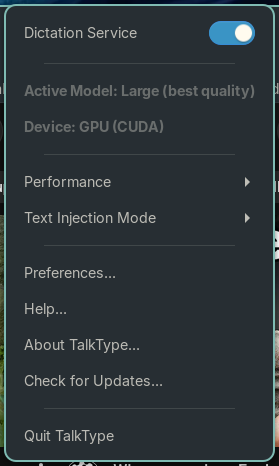
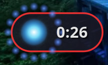
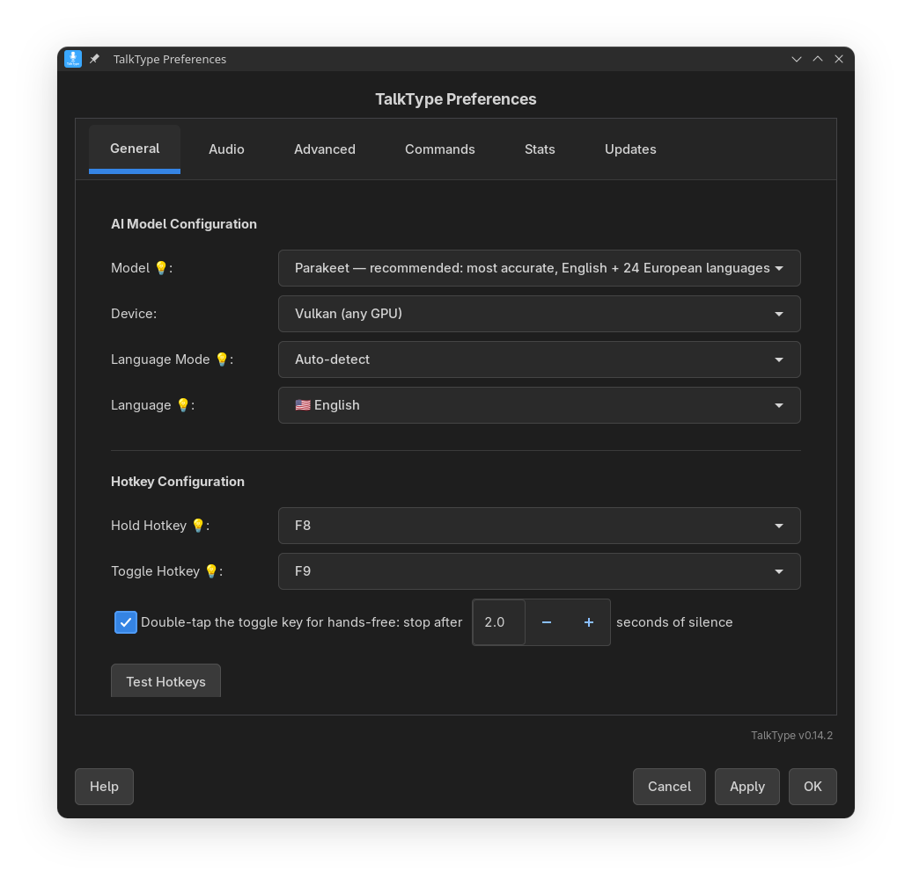
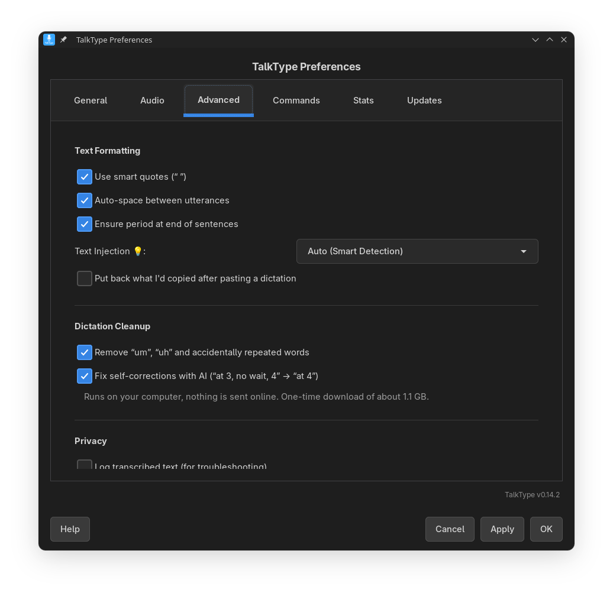
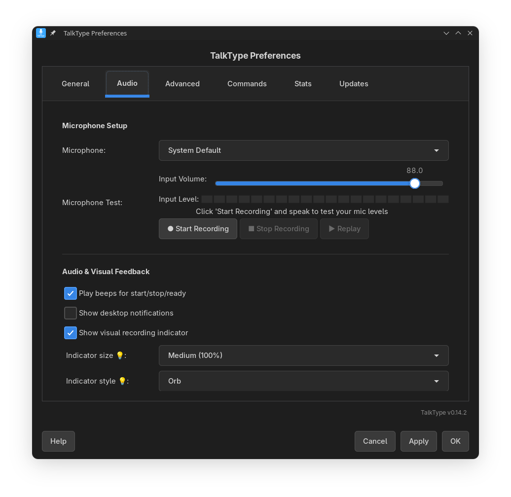
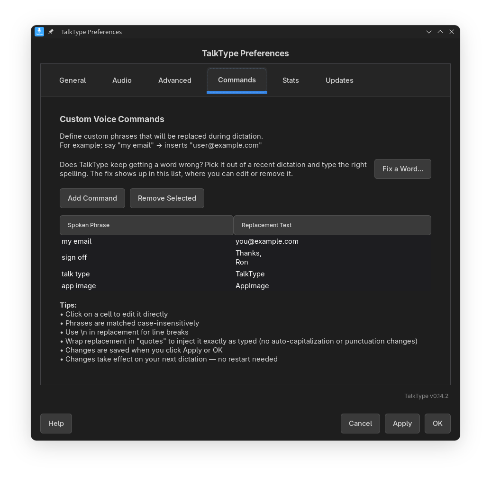
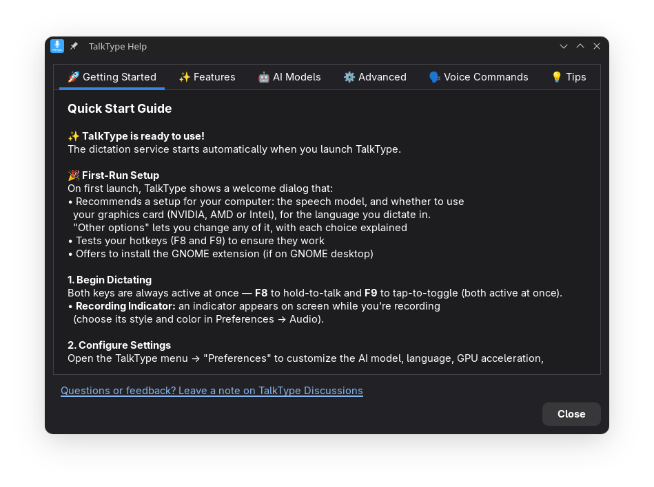
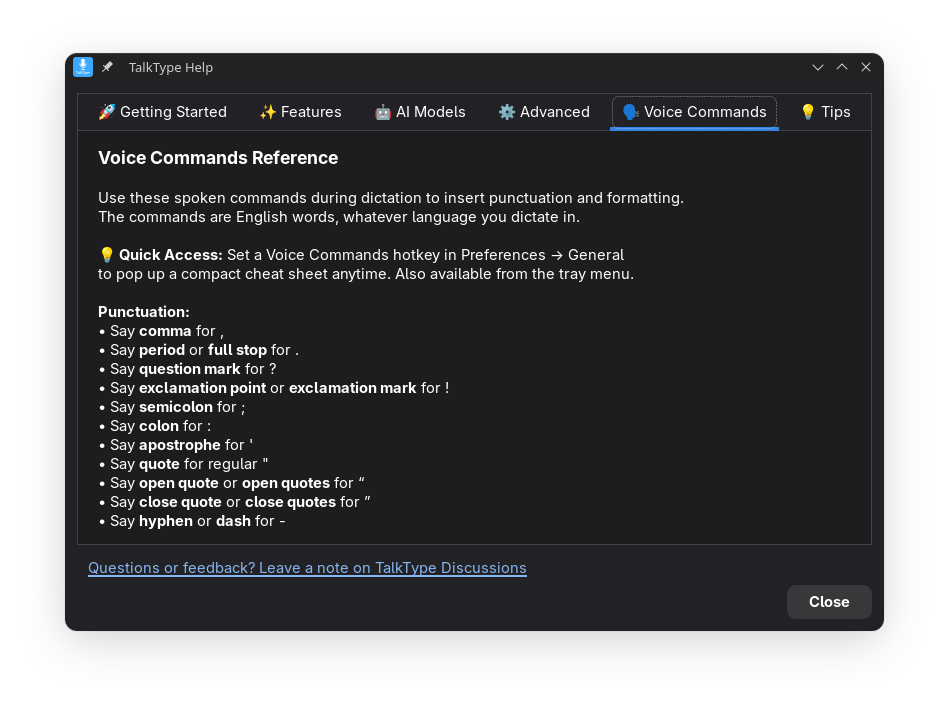

# TalkType: voice dictation for Linux

**Hold a key, talk, let go. Your words show up wherever your cursor is.**

That works on GNOME, KDE, Sway, Hyprland and X11 with no setup, because TalkType reads the key straight from the keyboard instead of asking the desktop for it. Most Linux dictation tools can't do hold-to-talk on Wayland at all.

It's free, it runs completely offline, and nothing you say ever leaves your computer.

[](https://aur.archlinux.org/packages/talktype-appimage)
[](https://github.com/ronb1964/TalkType/releases)
[](LICENSE)
[](https://github.com/ronb1964/TalkType)

<p align="center">
  
</p>

---

## Why TalkType?

Most voice dictation tools on Linux are either cloud-based (privacy concerns), command-line only (not user-friendly), or broken on Wayland. TalkType is different:

- **Global hotkeys that actually work on Wayland** — many Linux dictation tools rely on X11 key grabs (or `pynput`), which Wayland blocks by design. TalkType reads the key at the kernel level via `/dev/input`, below the compositor, so push-to-talk works the same on GNOME, KDE, Sway and Hyprland (X11 too).
- **100% offline** — All processing happens locally, using Whisper or Parakeet. Nothing is sent to the cloud.
- **Zero configuration** — Download the AppImage, run it, start talking. First-run wizard handles the rest.
- **Any desktop environment** — GNOME (with native shell extension), KDE, XFCE, Sway, Hyprland, and more.
- **Fast without a graphics card** — the Parakeet model gives large-v3 class accuracy in well under a second on an ordinary processor (English and 24 European languages).
- **GPU accelerated** — Optional NVIDIA CUDA support for 3-5x faster Whisper transcription.

---

## Screenshots

<p align="center">
  
  &nbsp;&nbsp;&nbsp;
  
</p>
<p align="center">
  <em>System tray menu &bull; Recording indicator with timer</em>
</p>

<p align="center">
  
  
</p>
<p align="center">
  <em>General settings with model selection &bull; Advanced settings with GPU acceleration</em>
</p>

<p align="center">
  
  
</p>
<p align="center">
  <em>Audio settings with microphone test &bull; Custom voice commands</em>
</p>

<p align="center">
  
  
</p>
<p align="center">
  <em>Built-in help with getting started guide &bull; Complete voice commands reference</em>
</p>

---

## Features

- **Dual Hotkeys Always Active** - F8 (hold-to-talk) AND F9 (tap-to-toggle) simultaneously - fully customizable
- **Hands-free** (optional) - Double-tap F9, talk, and the recording stops by itself when you go quiet. A single tap is still a normal on/off toggle, so long dictation with thinking pauses is never cut off
- **AI-Powered Transcription** - OpenAI's Whisper models (tiny to large-v3), or NVIDIA's Parakeet for fast, accurate dictation with no GPU
- **GPU Acceleration** - Optional NVIDIA CUDA support for 3-5x faster transcription, and AMD / Intel graphics support through Vulkan. TalkType times your graphics chip against your processor first and only uses it if it's faster
- **Smart Text Processing** - Auto-punctuation, smart quotes, auto-spacing
- **Voice Commands** - Say "comma", "period", "new paragraph", "undo last word", and more
- **Custom Commands** - Define your own phrase shortcuts (e.g., "my email" → your@email.com)
- **Visual Feedback** - On-screen recording indicator that reacts to your voice, with four styles (orb, waveform, frequency bars, radial), custom colors, and positioning anywhere on screen
- **Dictation Cleanup** (optional) - Remove "um", "uh" and accidentally repeated words instantly, and optionally let a small AI model that runs on your own computer fix self-corrections ("meet at 3, no wait, 4" becomes "meet at 4"). Every AI edit is checked, and if it changed anything besides the correction your words are typed exactly as spoken. The AI uses your graphics card if you have one (NVIDIA, AMD or Intel) and your processor otherwise
- **Fix a Word** - Teach TalkType a word it keeps getting wrong. Pick it out of a recent dictation, type the right spelling, and it's fixed in every dictation from then on. Great for names, brands and technical terms, and it works with every speech model
- **Your Stats** - Pick Your Stats from the tray menu to see how many words you've dictated today, this week and all time, how much typing time it saved (at your own typing speed), and a chart of the last two weeks. Only the numbers are kept, on your computer, never what you said
- **Recent Dictations** - Your last 20 dictations in the tray menu. Hover to read one, click to copy it again, handy when text lands in the wrong window. Kept in memory only and wiped at logout
- **Private by Default** - Fully offline transcription, and your dictated text is never written to the log (opt-in only, for troubleshooting)
- **GNOME Integration** - Native shell extension for GNOME desktop
- **Smart Updates** - Built-in update checker that updates the right way for how you installed: through your package manager on `.deb`/`.rpm` (one click, one password prompt), in place for the AppImage, or via your AUR helper on Arch
- **Wayland Native** - Works seamlessly on modern Linux desktops

---

## Installation

### Arch Linux (AUR)

```bash
yay -S talktype-appimage
# or
paru -S talktype-appimage
```

Installed it and it works? A
[vote on the AUR page](https://aur.archlinux.org/packages/talktype-appimage)
helps other Arch users find it — one click if you're logged in.

### Debian / Ubuntu / Linux Mint (.deb)

Download `talktype_*_amd64.deb` from [Releases](https://github.com/ronb1964/TalkType/releases):

```bash
sudo apt install ./talktype_*_amd64.deb
```

### Fedora / RHEL / openSUSE (.rpm)

Download `talktype-*.x86_64.rpm` from [Releases](https://github.com/ronb1964/TalkType/releases):

```bash
sudo dnf install ./talktype-*.x86_64.rpm
```

Both packages install to `/opt/talktype`, add a `talktype` command and an
Applications menu entry, and pull in the few system libraries they need.

### AppImage (All Distros)

Download the latest AppImage from [Releases](https://github.com/ronb1964/TalkType/releases):

```bash
chmod +x TalkType-v*.AppImage
./TalkType-v*.AppImage
```

The AppImage includes everything needed - just download and run!

> **Note:** AppImages require FUSE 2 (`libfuse.so.2`). Install if needed:
> - **Fedora/RHEL**: `sudo dnf install fuse`
> - **Ubuntu/Debian**: `sudo apt install libfuse2`
> - **Arch/Manjaro**: `sudo pacman -S fuse2`
> - **openSUSE**: `sudo zypper install libfuse2`

### Flatpak

A sandboxed Flatpak build of TalkType already works, but it isn't published for
download yet. **Want a Flatpak version?**
👉 **[Vote in the poll](https://github.com/ronb1964/TalkType/discussions/6)** —
enough interest and I'll make it happen.

### System Requirements

| Requirement | Details |
|------------|---------|
| **OS** | Linux with Wayland |
| **Dependencies** | None to install by hand — ydotool, ydotoold and wl-clipboard ship inside TalkType, and the ydotoold daemon starts automatically on first run |
| **Permissions** | First run asks for your admin password once, to let TalkType read your keyboard and type into other apps. **Restart afterwards** for it to take effect |
| **Audio** | Working microphone |
| **GPU (optional)** | NVIDIA GPU for CUDA acceleration |

---

## Quick Start

1. **Launch TalkType** - Run the AppImage or use your app launcher
2. **First-run setup** - TalkType will guide you through initial configuration
3. **Start dictating** - Press **F8** (hold to record) or **F9** (tap to toggle) — both always active
4. **Speak naturally** - Text appears where your cursor is
5. **Use voice commands** - Say "comma", "period", "new line", etc.

### Hotkeys (Both Always Active)

| Hotkey | How it works |
|--------|--------------|
| **F8** | Hold to record, release to transcribe (hold-to-talk) |
| **F9** | Press once to start, press again to stop (tap-to-toggle) |

---

## Voice Commands

### Punctuation
| Say This | Result |
|----------|--------|
| "comma" | , |
| "period" / "full stop" | . |
| "question mark" | ? |
| "exclamation point" | ! |
| "colon" | : |
| "semicolon" | ; |
| "open quote" / "close quote" | " " (smart quotes) |
| "dot dot dot" / "ellipsis" | ... |

### Formatting
| Say This | Result |
|----------|--------|
| "new line" | Line break |
| "new paragraph" | Double line break |
| "tab" | Tab character |

### Editing
| Say This | Result |
|----------|--------|
| "undo last word" | Deletes the last word |
| "undo last sentence" | Deletes to the previous sentence |
| "undo last paragraph" | Deletes the last paragraph |
| "delete last three words" | Deletes several at once — words, sentences or paragraphs |
| "delete last 5 sentences" | Digits work too; counts above what you dictated are clamped |
| "clear everything" | Clears the **entire** input field (see warning below) |

**Undo, delete and remove are interchangeable** — say whichever comes naturally
("delete last word", "remove last two sentences"). Counts accept digits or the
words one through ten.

> ⚠️ **"clear everything" empties the whole field, not just what you dictated.**
> The phrases *undo/delete/clear* + *everything/all* — six in total — all do the
> same thing: select all and delete. That includes text you typed yourself, so
> it is not limited to the current dictation.

### Literal Words
Say **"literal"** before any command to output the word instead:
- "literal comma" → types "comma" (not ,)
- "literal period" → types "period" (not .)

---

## AI Models

Choose the right model for your needs in Preferences → General:

| Model | Size | Speed | Accuracy | Best For |
|-------|------|-------|----------|----------|
| **tiny** | 39 MB | Fastest | Basic | Quick notes |
| **base** | 74 MB | Fast | Good | Casual use |
| **small** | 244 MB | Balanced | Very Good | **Recommended** |
| **medium** | 769 MB | Slower | Excellent | Professional |
| **large-v3** | ~3 GB | Slowest | Best | Technical work |
| **Parakeet** | 670 MB | Fast, even without a GPU | Best | English + 24 European languages |

> **Tip:** Start with "small" for everyday use. Enable GPU acceleration for larger models.
> No NVIDIA card? Try **Parakeet** (Preferences, or tray → Performance → Fast & Accurate). It is a different engine from NVIDIA and runs on your processor, but it does not cover Chinese, Japanese, Korean, Arabic and other non-European languages. Use a Whisper model for those.

---

## GPU Acceleration

TalkType supports NVIDIA CUDA for 3-5x faster transcription:

1. **Automatic detection** - TalkType detects your NVIDIA GPU on first run
2. **One-click download** - Download CUDA libraries (~800MB) when prompted
3. **Automatic activation** - GPU mode enables after download

You can also enable GPU later: **Preferences → Advanced → Download CUDA Libraries**

---

## Configuration

Settings are stored in `~/.config/talktype/config.toml`:

```toml
model = "small"           # AI model: tiny, base, small, medium, large-v3
device = "cpu"            # "cpu" or "cuda" (GPU)
hold_hotkey = "F8"        # Hold-to-talk key (hold to record, release to stop)
toggle_hotkey = "F9"      # Tap-to-toggle key (press once start, press again stop)
# Both hotkeys are always active simultaneously
language_mode = "auto"    # "auto" or specific language code
beeps = true              # Audio feedback sounds
smart_quotes = true       # Use curly quotes " "
auto_space = true         # Auto-space between utterances
auto_period = true        # Add period at end of sentences
```

---

## Development

### From Source

```bash
# Prerequisites (Fedora/Nobara)
sudo dnf install -y portaudio-devel ffmpeg ydotool wl-clipboard \
                    python3-gobject libayatana-appindicator-gtk3 libnotify

# Clone and install
git clone https://github.com/ronb1964/TalkType.git
cd TalkType
poetry install

# Run
poetry run dictate-tray
```

### ydotool Setup

TalkType requires ydotool for text injection:

```bash
# Create systemd service
mkdir -p ~/.config/systemd/user
cat > ~/.config/systemd/user/ydotoold.service <<'EOF'
[Unit]
Description=ydotool daemon
After=graphical-session.target

[Service]
Environment=XDG_RUNTIME_DIR=%t
ExecStart=/usr/bin/ydotoold --socket-path=%t/.ydotool_socket
Restart=on-failure

[Install]
WantedBy=default.target
EOF

# Enable and start
systemctl --user daemon-reload
systemctl --user enable --now ydotoold.service
```

---

## Troubleshooting

### Text not appearing?
- Check ydotoold is running: `systemctl --user status ydotoold`
- Verify socket exists: `ls $XDG_RUNTIME_DIR/.ydotool_socket`

### Hotkey not working?
- Another app may be using F8/F9 - try different keys in Preferences
- Ensure TalkType service is running (check tray icon)

### No hotkey works at all?
TalkType reads your keyboard directly, which requires your account to be in the
system's `input` group. Without it no key can be detected, even though the app
looks like it started fine.

- Preferences → Advanced → Typing Setup → **Fix Typing Permissions**
- **Then restart your computer.** Logging out and back in is often not enough —
  a lingering user session keeps the old group list alive
- Check it worked with `groups`; the list should include `input`

Most common on Fedora, where permission to *type* is granted separately from
permission to *read keys*, so typing can work while hotkeys do not.

### Transcription slow?
- Enable GPU acceleration if you have NVIDIA GPU
- Try a smaller model (tiny or base)
- Use Performance presets in tray menu

### Tray icon not visible (GNOME)?
- TalkType offers to install its GNOME extension on first run
- Or manually: Preferences → Advanced → Install Extension

---

## License

MIT License - see [LICENSE](LICENSE) file for details.

---

<p align="center">
  <b>TalkType</b> - Voice dictation that just works.<br>
  <a href="https://github.com/ronb1964/TalkType/releases">Download</a> &bull;
  <a href="CHANGELOG.md">Changelog</a> &bull;
  <a href="https://github.com/ronb1964/TalkType/issues">Report Bug</a> &bull;
  <a href="https://github.com/ronb1964/TalkType/issues">Request Feature</a>
</p>
